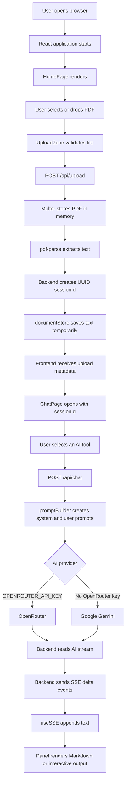

# DocFable

DocFable is an AI-powered PDF research assistant. Users upload a PDF, ask questions about it, generate summaries, create flashcards and quizzes, and extract structured insights.

The application has two services:

- **Frontend:** React, Vite, Tailwind CSS, and React Router
- **Backend:** Node.js, Express, PDF parsing, and streaming AI responses

## Table of Contents

- [What the Application Does](#what-the-application-does)
- [Complete Request Flow](#complete-request-flow)
- [Project Structure](#project-structure)
- [Frontend Components](#frontend-components)
- [Backend Components](#backend-components)
- [AI and Prompt Flow](#ai-and-prompt-flow)
- [Server-Sent Events](#server-sent-events)
- [Libraries](#libraries)
- [Local Development](#local-development)
- [Docker](#docker)
- [Environment Variables](#environment-variables)
- [API Endpoints](#api-endpoints)
- [Important Limitations](#important-limitations)

## What the Application Does

DocFable converts an uploaded PDF into a temporary document session. The extracted text is then used as context for several AI tools:

1. **Chat:** Ask questions about the document.
2. **Summary:** Generate executive, beginner-friendly, technical, or bullet-point summaries.
3. **Flashcards:** Generate interactive question-and-answer study cards.
4. **Quiz:** Generate multiple-choice or short-answer questions.
5. **Insights:** Extract contributions, strengths, limitations, future scope, statistics, and terminology.

## Complete Request Flow



### Upload flow in detail

1. `UploadZone` receives a selected or dropped file.
2. The browser checks that the file is a PDF and no larger than 20 MB.
3. `api.js` sends the file as `multipart/form-data`.
4. Express routes the request to `routes/upload.js`.
5. Multer stores the file buffer in memory.
6. `pdf-parse` extracts the PDF text and page count.
7. The backend trims very large documents to approximately 300,000 characters.
8. `uuid` creates a unique `sessionId`.
9. The backend saves the document in an in-memory `Map`.
10. The backend returns the session ID and document metadata.

### AI analysis flow in detail

1. The selected panel calls `useSSE`.
2. `useSSE` calls `streamChat` in `services/api.js`.
3. The browser sends the `sessionId`, mode, and mode-specific options to `/api/chat`.
4. The backend looks up the document using the session ID.
5. `promptBuilder.js` creates the AI instructions.
6. OpenRouter is used when `OPENROUTER_API_KEY` is configured.
7. Google Gemini is used as the fallback provider.
8. The backend forwards each generated text chunk as an SSE event.
9. The frontend appends each chunk to its current state.
10. The relevant panel renders the completed response.

## Project Structure

```text
DocFable/
├── docker-compose.yml
├── README.md
├── backend/
│   ├── Dockerfile
│   ├── package.json
│   ├── server.js
│   ├── test-openrouter.js
│   ├── routes/
│   │   ├── chat.js
│   │   ├── health.js
│   │   └── upload.js
│   └── utils/
│       └── promptBuilder.js
└── frontend/
    ├── Dockerfile
    ├── index.html
    ├── nginx.conf
    ├── package.json
    ├── postcss.config.js
    ├── tailwind.config.js
    ├── vite.config.js
    └── src/
        ├── App.jsx
        ├── index.css
        ├── main.jsx
        ├── components/
        ├── hooks/
        ├── pages/
        └── services/
```

## Frontend Components

### Application and routing

#### `frontend/src/main.jsx`

The browser entry point. It:

- Creates the React root.
- Enables `React.StrictMode`.
- Wraps the application in `BrowserRouter`.
- Loads the global stylesheet.

#### `frontend/src/App.jsx`

Defines the application routes:

| Route | Component | Purpose |
|---|---|---|
| `/` | `HomePage` | Landing page and PDF upload |
| `/chat` | `ChatPage` | Main document analysis workspace |
| `/about` | `AboutPage` | Project information and technology overview |
| `*` | Inline 404 view | Unknown routes |

`Navbar` is rendered above the routes so it appears on every page.

### Pages

#### `frontend/src/pages/HomePage.jsx`

Displays the landing page, feature overview, upload zone, and call-to-action buttons. After a successful upload, it passes the returned `uploadData` to `/chat` through React Router state.

#### `frontend/src/pages/ChatPage.jsx`

The main analysis workspace. It contains:

- A left document panel.
- Document metadata.
- The AI tool selector.
- A collapsible sidebar.
- The currently selected analysis panel.

The active tool is one of:

```text
chat, summary, flashcards, quiz, insights
```

The important value passed to every panel is `sessionId`. This ID connects the browser request to the document stored by the backend.

#### `frontend/src/pages/AboutPage.jsx`

A presentational page explaining the project, objectives, architecture, stack, and API endpoints.

### Reusable components

#### `frontend/src/components/Navbar.jsx`

Provides desktop and mobile navigation using React Router links. It tracks the current URL to highlight the active page and manages the mobile menu state.

#### `frontend/src/components/UploadZone.jsx`

Handles PDF selection and drag-and-drop upload. It manages idle, uploading, success, and error states. It displays upload progress and returns the backend response to its parent through `onUploadSuccess`.

#### `frontend/src/components/ChatPanel.jsx`

Implements document chat. It stores user and assistant messages, sends questions, displays streaming responses, supports suggested questions, and allows the user to stop a response.

#### `frontend/src/components/SummaryPanel.jsx`

Allows the user to choose one of four summary styles and sends the selected style to the backend. The result is rendered as Markdown.

#### `frontend/src/components/FlashcardPanel.jsx`

Requests a selected number of flashcards, parses the AI response using a regular expression, and renders each card as a clickable question/answer card.

#### `frontend/src/components/QuizPanel.jsx`

Requests MCQ or short-answer quizzes. MCQs are parsed into interactive questions. The user can select an option and immediately see whether it was correct and why.

#### `frontend/src/components/InsightsPanel.jsx`

Requests a structured analysis of the document and renders the resulting Markdown.

#### `frontend/src/components/MessageBubble.jsx`

Renders one user or assistant chat message. Assistant messages use `react-markdown`; streaming messages display a typing cursor.

#### `frontend/src/components/FeatureCards.jsx`

A presentational grid describing the product features. It does not communicate with the backend.

### Streaming hook and API service

#### `frontend/src/hooks/useSSE.js`

A reusable React hook for AI streaming. It exposes:

```js
{
  content,
  isStreaming,
  error,
  startStream,
  stopStream,
  reset
}
```

It uses `AbortController` to cancel an active request and updates the UI as text chunks arrive.

#### `frontend/src/services/api.js`

Contains browser-to-backend communication:

- `uploadPDF(file, onProgress)` uses Axios and `FormData`.
- `streamChat(payload, onDelta, onDone, onError)` uses native `fetch` and reads the streaming response.
- `checkHealth()` calls the health endpoint.

The frontend uses `/api` as its base URL. Vite proxies this path to `http://localhost:5000` during development.

## Backend Components

### `backend/server.js`

Creates and starts the Express server. It configures:

- `dotenv` for environment variables.
- `cors` for frontend access.
- `morgan` for request logs.
- JSON and URL-encoded body parsing.
- Health, upload, and chat routes.
- Global error and 404 handlers.

The default backend port is `5000`.

### `backend/routes/health.js`

Provides:

```text
GET /api/health
```

Returns service status, version, timestamp, and configured model information. Docker uses this endpoint as its health check.

### `backend/routes/upload.js`

Provides:

```text
POST /api/upload
GET /api/upload/:sessionId
```

Responsibilities:

- Accept only PDF files.
- Enforce a 20 MB upload limit.
- Parse PDF text with `pdf-parse`.
- Reject PDFs with no usable text.
- Trim very large documents.
- Create a UUID session.
- Store document data in memory.
- Remove sessions older than two hours.

The shared `documentStore` is exported so `chat.js` can retrieve the uploaded document.

### `backend/routes/chat.js`

Provides:

```text
POST /api/chat
```

It validates the session, builds the requested prompt, selects an AI provider, and streams the response through SSE.

Supported modes:

```text
chat
summary
flashcards
quiz
insights
```

OpenRouter has priority. Gemini is used when OpenRouter is not configured.

### `backend/utils/promptBuilder.js`

Contains the prompt-generation functions:

```js
buildChatPrompt()
buildSummaryPrompt()
buildFlashcardsPrompt()
buildQuizPrompt()
buildInsightsPrompt()
```

Each function returns a system prompt and a user prompt. The system prompt restricts the AI to the uploaded document and asks it to use Markdown. The user prompt contains the document text and the specific task.

The prompt builder also limits the context to approximately 250,000 characters before sending it to the AI provider.

## AI and Prompt Flow

The backend builds prompts differently for each mode:

| Mode | Extra input | Expected output |
|---|---|---|
| `chat` | User question | Markdown answer |
| `summary` | Summary type | Markdown summary |
| `flashcards` | Number of cards | Strict `Qn`/`An` format |
| `quiz` | Quiz type and count | MCQ or short-answer format |
| `insights` | None | Structured Markdown sections |

The AI is instructed to say that information is unavailable when it cannot find an answer in the uploaded document.

## Server-Sent Events

DocFable uses Server-Sent Events instead of waiting for a complete AI response.

The backend sends events such as:

```text
data: {"type":"start","mode":"chat","filename":"paper.pdf"}

data: {"type":"delta","content":"The main idea is..."}

data: {"type":"done"}
```

The frontend reads the response body with `ReadableStream.getReader()`. Each `delta` is appended to the current `content` state, so text appears as it is generated.

If an error occurs during an already-open stream, the backend sends:

```text
data: {"type":"error","message":"..."}
```

## Libraries

### Frontend

| Library | Purpose |
|---|---|
| React | Component-based user interface |
| React DOM | Mounts React in the browser |
| React Router DOM | Client-side routing |
| Vite | Development server and production bundler |
| Axios | Upload and standard HTTP requests |
| React Markdown | Render AI Markdown responses |
| Remark GFM | Tables and GitHub-flavored Markdown |
| Lucide React | UI icons |
| Tailwind CSS | Utility-first styling |
| PostCSS | CSS processing |
| Autoprefixer | Browser CSS compatibility |
| Framer Motion | Installed animation library; current UI mainly uses CSS/Tailwind animations |
| React Syntax Highlighter | Installed for code highlighting; not currently central to the rendered panels |
| Rehype Raw | Installed Markdown/HTML processing support |

### Backend

| Library | Purpose |
|---|---|
| Express | HTTP server and routing |
| CORS | Cross-origin request handling |
| Dotenv | Loads `.env` configuration |
| Morgan | HTTP request logging |
| Multer | Multipart file uploads |
| PDF Parse | Extracts text from PDFs |
| UUID | Generates document session IDs |
| `@google/generative-ai` | Google Gemini integration |
| Nodemon | Automatically restarts the development server |
| Native Node `fetch` | Calls OpenRouter and reads its stream |

## Local Development

### Prerequisites

- Node.js 20 or newer
- npm
- An OpenRouter or Gemini API key

### Start the backend

```bash
cd backend
npm install
npm run dev
```

The backend runs at:

```text
http://localhost:5000
```

### Start the frontend

Open another terminal:

```bash
cd frontend
npm install
npm run dev
```

The frontend runs at:

```text
http://localhost:5173
```

Vite proxies `/api` requests to the backend.

### Production frontend build

```bash
cd frontend
npm run build
npm run preview
```

## Docker

Build and start both services from the project root:

```bash
docker compose up --build
```

The application is then available at:

```text
http://localhost:3000
```

The frontend container builds the React app and serves it with Nginx. Nginx proxies `/api` requests to the backend container and disables proxy buffering so SSE responses remain real-time.

## Environment Variables

Create `backend/.env` from `backend/.env.example`.

```env
PORT=5000
FRONTEND_URL=http://localhost:5173
NODE_ENV=development

# Recommended provider
OPENROUTER_API_KEY=your_openrouter_key
OPENROUTER_MODEL=google/gemini-2.0-flash-exp:free

# Fallback provider
GEMINI_API_KEY=your_gemini_key
GEMINI_MODEL=gemini-2.0-flash-lite
```

Provider selection is:

1. OpenRouter when `OPENROUTER_API_KEY` is valid.
2. Gemini when only `GEMINI_API_KEY` is valid.
3. HTTP 503 when neither provider is configured.

### Docker configuration note

The current `docker-compose.yml` passes `OPENAI_API_KEY` and `OPENAI_MODEL`, but the backend code reads `OPENROUTER_API_KEY`, `OPENROUTER_MODEL`, `GEMINI_API_KEY`, and `GEMINI_MODEL`. For Docker AI requests to work, the Compose environment should be aligned with the backend variables.

## API Endpoints

### Health check

```http
GET /api/health
```

### Upload a PDF

```http
POST /api/upload
Content-Type: multipart/form-data
```

Form field:

```text
pdf=<PDF file>
```

Example response:

```json
{
  "sessionId": "generated-uuid",
  "filename": "paper.pdf",
  "pageCount": 12,
  "wordCount": 8400,
  "charCount": 51000,
  "truncated": false,
  "message": "PDF uploaded and parsed successfully"
}
```

### Get session metadata

```http
GET /api/upload/:sessionId
```

### Generate an AI response

```http
POST /api/chat
Content-Type: application/json
```

Chat example:

```json
{
  "sessionId": "generated-uuid",
  "mode": "chat",
  "question": "What problem does this paper solve?"
}
```

Summary example:

```json
{
  "sessionId": "generated-uuid",
  "mode": "summary",
  "summaryType": "technical"
}
```

Flashcard example:

```json
{
  "sessionId": "generated-uuid",
  "mode": "flashcards",
  "count": 10
}
```

Quiz example:

```json
{
  "sessionId": "generated-uuid",
  "mode": "quiz",
  "quizType": "mcq",
  "count": 5
}
```

Insights example:

```json
{
  "sessionId": "generated-uuid",
  "mode": "insights"
}
```

The response is an SSE stream rather than one normal JSON response.

## Important Limitations

- Documents are stored only in memory and disappear when the backend restarts.
- Sessions expire after approximately two hours.
- Scanned or image-only PDFs are not processed with OCR.
- Large PDFs are truncated before being sent to the AI model.
- Flashcards and MCQs depend on the AI following the format requested by the prompt.
- The current Docker Compose file contains older OpenAI variable names and should be aligned with the current OpenRouter/Gemini backend configuration.
- Some About page text still refers to OpenAI/GPT even though the active backend providers are OpenRouter and Gemini.
# DocFable-V2
